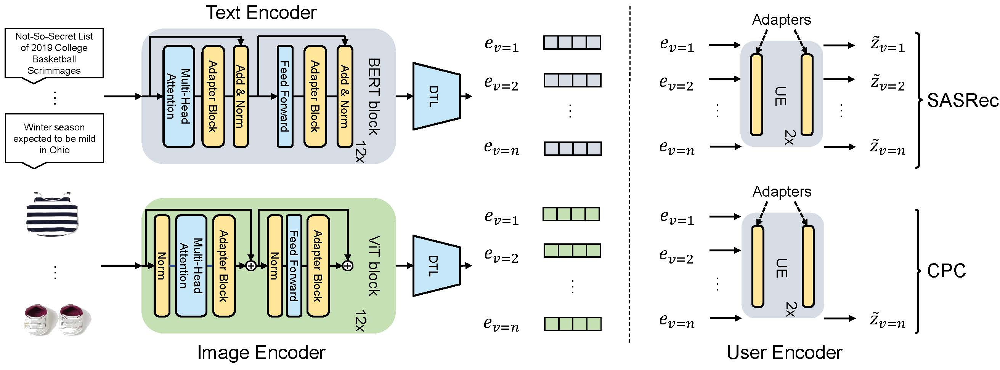

# Adapter4Rec （WSDM2024）

This repository contains the source code for our Paper: **''[Exploring Adapter-based Transfer Learning for Recommender Systems: Empirical Studies and Practical Insights](https://arxiv.org/pdf/2305.15036.pdf)''**.  

【blog】 (1)https://zhuanlan.zhihu.com/p/684389843/ (2)https://medium.com/@lifengyi_6964/parameter-efficient-adapter-transfer-for-multi-domain-recommendation-329bf3c32a60

🤗 **Resources**: four Large-scale datasets for evaluating foundation / transferable / multi-modal / LLM recommendaiton models.

-  **PixelRec**: https://github.com/westlake-repl/PixelRec
  
-  **NineRec(TPAMI)**: https://github.com/westlake-repl/NineRec 

-  **Tenrec(NeurIPS)**: https://github.com/yuangh-x/2022-NIPS-Tenrec
  
-  **MicroLens(DeepMind Talk)**: https://github.com/westlake-repl/MicroLens


 

## Abstract

Adapters, a plug-in neural network module with some tunable  parameters, have emerged as a parameter efficient transfer learning  technique for adapting  pre-trained models to downstream tasks, especially for natural language processing (NLP) and  computer vision (CV) fields. Meanwhile, learning recommender system (RS) models directly from  raw item modality features ---  e.g., texts of NLP and images of CV --- can enable effective and transferable recommendations  (called TransRec). In view of this, a natural question arises: can  adapter-based learning techniques achieve parameter-efficient TransRec with good performance?

To this end, we perform  empirical studies  to address several key sub-questions. First, we ask whether the adapter-based TransRec performs comparably to TransRec based on standard full-parameter fine-tuning? does it hold for recommendation with different item modalities, e.g., textual RS and visual RS. If yes, we benchmark these existing adapters, which have been shown to be effective in  NLP and CV tasks, in item recommendation tasks. Third, we carefully study several key factors for the adapter-based TransRec in terms of where and how to insert these adapters? Finally, we look at the effects of adapter-based TransRec by either scaling up its source training data or  scaling down its target training data. Our paper provides key insights and practical guidance on unified & transferable recommendation --- a less studied recommendation scenario.


## Requirements

```
- torch == 1.7.1+cu110
- torchvision==0.8.2+cu110
- transformers==4.20.1
- loralib==0.1.1
```


## Preparation

The complete textual recommendation dataset (MIND & Adressa) is available under the Dataset directory. 

Download the image files:

"hm_images.zip" for HM dataset from this [link](https://drive.google.com/file/d/1zm0V3th-_ZxAevQM5yt8tkbLHnXGc6lk/view?usp=drive_link)

"am_image.zip" for Amazon Clothes&Shoes dataset from this [link](https://drive.google.com/file/d/1r8UJKFfhx_p93Q5DGOXDvXPq6PQYD_Iz/view?usp=drive_link)

Then put them under Dataset/HM and Dataset/Amazon, respectively. Finally, please use the "build_lmdb_hm.py" scripts from [IDvs.MoRec](https://github.com/westlake-repl/IDvs.MoRec/tree/main/dataset/HM) to generate the LMDB file.


### Pre-trained Model Download

We report details of the pre-trained Item ME we used in Table. Download the pytorch-version of them, and put the checkpoint `pytorch_model.bin` into the corresponding path under `pretrained_models/`

| Pre-trained model      | #Param. | URL                                                |
| ---------------------- | ------- | -------------------------------------------------- |
| BERT<sub>base</sub>    | 109M    | https://huggingface.co/bert-base-uncased           |
| RoBERTa<sub>base</sub> | 125M    | https://huggingface.co/roberta-base                |
| ViT<sub>base</sub>     | 86M     | https://huggingface.co/google/vit-base-patch16-224 |
| MAE<sub>base</sub>     | 86M     | https://huggingface.co/facebook/vit-mae-base       |

We provide the following checkpoints pre-trained on the source datasets:

[SASRec+BERT](https://drive.google.com/file/d/16xIo2ygB4b3ERrg81zDzBXXUfdLw86Ss/view?usp=drive_link), [CPC+BERT](https://drive.google.com/file/d/1lqjH8z4Ta_jnxWTYdilL338OoYGPF9wW/view?usp=drive_link), [SASRec+ViT](https://drive.google.com/file/d/1aaWa6CK0an6RxPGFDOnDQXYgnkJd5HGP/view?usp=drive_link), and [CPC+ViT](https://drive.google.com/file/d/1YTKzg1ZgFrxAvM6xhCZnG49jeHCLSHIG/view?usp=drive_link)

The SASRec/CPC+BERT pretrained checkpoint should be placed under Downstream/Text/pretrained_models and SASRec/CPC+ViT under Downstream/CV/pretrained_models.

## Training

An example of Source:
For pretraining text TranRec:

```
cd Pretraining/Text/script
python sm_base_sasrec.py
```

We select the checkpoint with the best validation result as the pre-trained checkpoint for the downstream tasks. Please note that the pretraining process may take a considerable amount of time. Our pre-trained image recommendation model was trained on the source domain using four A40 GPUs for approximately 3 to 4 days.


An example of Downstream:
For training text TranRec with the classic Houlsby adapter:

```
cd Downstream/Text/script
python adapter_houlsby.py
```

We report the test results of the checkpoint with the best validation result. 


